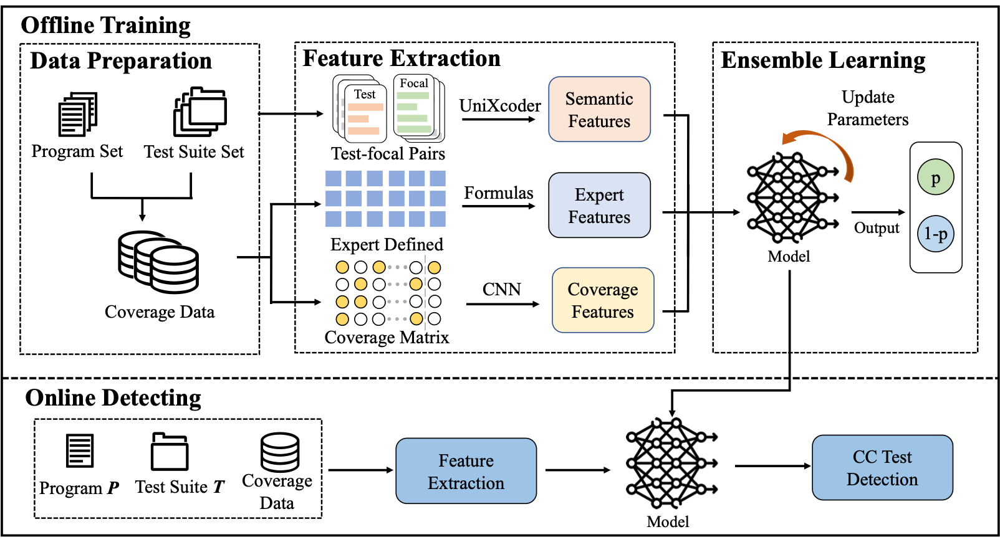

# Combining Coverage and Expert Features with Semantic Representation for Coincidental Correctness Detection

## Overview



## Requirements

- OS: Linux
- Python Package:
   - chardet==4.0.0
   - numpy==1.20.3
   - pandas==1.3.4
   - pyclustering==0.10.1.2
   - PyYAML==6.0
   - scikit_learn==1.2.1
   - scipy==1.7.1
   - torch==1.10.2

``pip install -r requirements.txt``

## Project Structure
```
CORE
├── CONFIG.py
├── requirements.txt
├── cc
│   ├── CCGroundTruthPipeline.py
│   ├── CCinfo.yaml
│   ├── ReadData.py
│   ├── allinfo.yaml
│   ├── cc_baselines        # baselines
│   ├── cc_evaluation       # evaluation metrics of CC test detection
│   ├── core.py
│   ├── CORE     						# our approach
│   └── ablation_exp				# ablation experiment
├── fl_evaluation   # the suspicious evaluation of AFL
├── read_data       # read data
└── utils           
```
